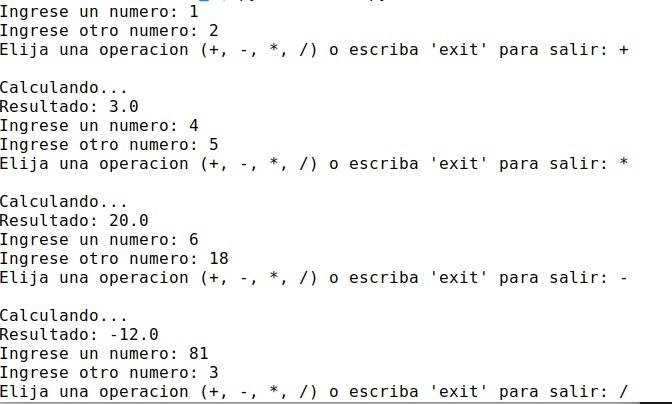
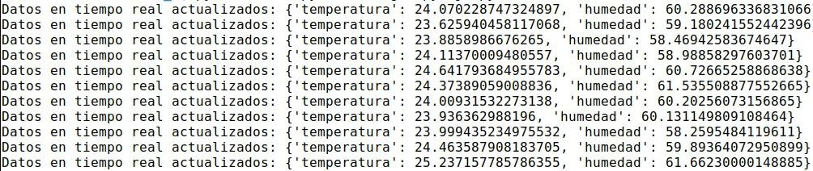

# Laboratorio 6

El presente laboratorio emplea callbacks y funciones lambda para simplificar la programación de cálculos sobre datos.
El archivo calc.py genera cálculos de números usando funciones lambda definidas que son ejecutadas mediante callbacks

## Descripción de los módulos:

* calc: corresponde a un módulo que ejecuta operaciones aritméticas sobre un conjunto de datos. Trabaja sobre dos números y una operación designada por usuario.
* ej1: Clase EventManager. Sirve para gestionar el manejo de eventos. Tiene métodos para suscribir, desuscribir y notificar.
* datamanager: Clase RealTimeDataManager. Se encarga de generar resultados actualizados acerca de la temperatura y la humedad.
* main.py: gestiona el acceso a RealTimeDataManager. Se encarga de crear la instancia de la clase y ejecutar sus métodos mediante el uso de hilos.

## Ejemplos de resultados:

Para la calculadora, se muestran las siguientes pruebas:

Como se puede ver, la calculadora recibe los datos apropiados y genera resultados correctos dependiendo de la operación solicitada por el usuario.

## Ejemplos de resultados

Para el Event Manager, se adjuntan las siguientes pruebas:

Como se puede observar, los datos de temperatura y humedad son imprimidos en la terminal de manera apropiada siguiendo el patrón que se muestra en el enunciado del proyecto.